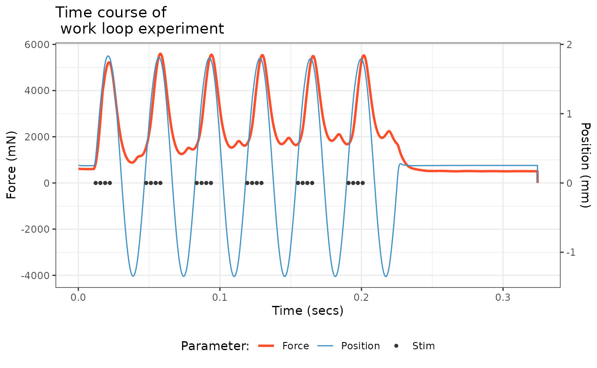
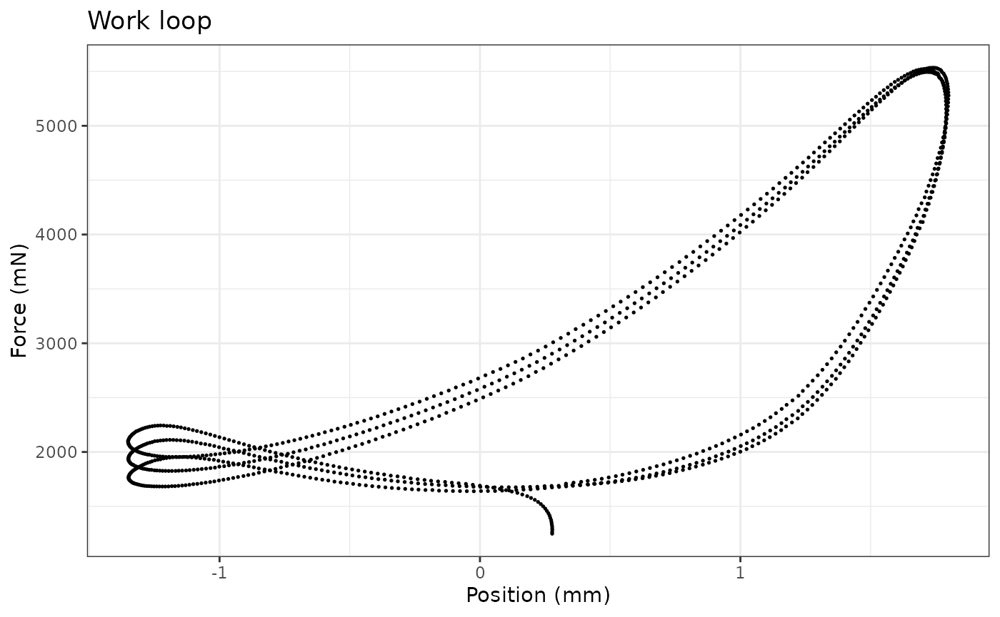
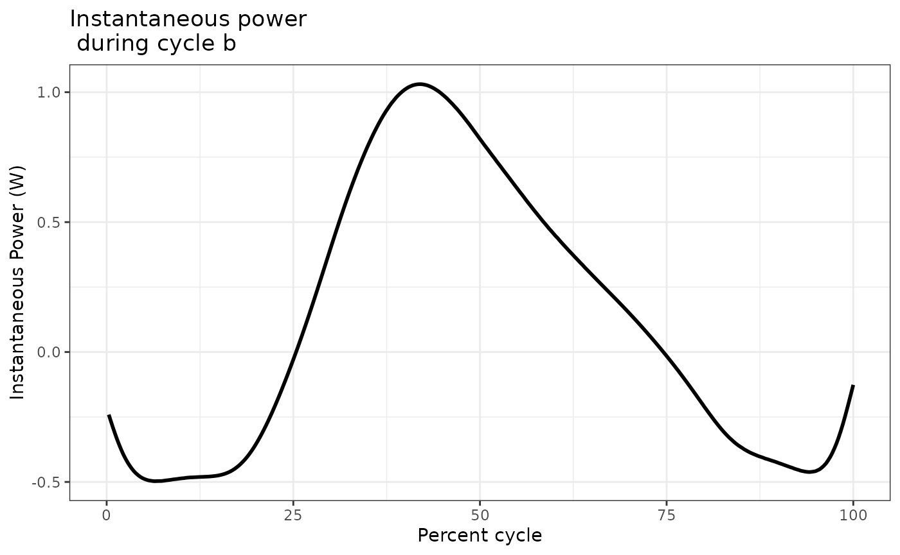
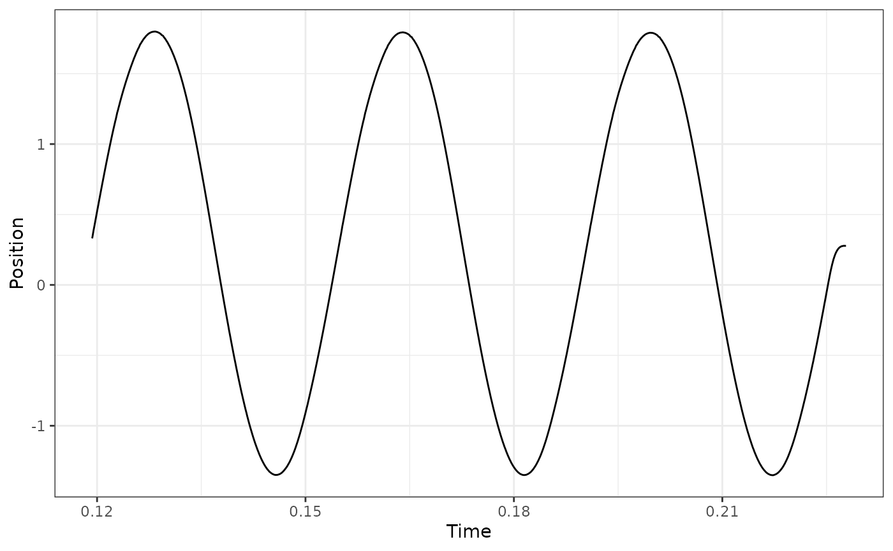
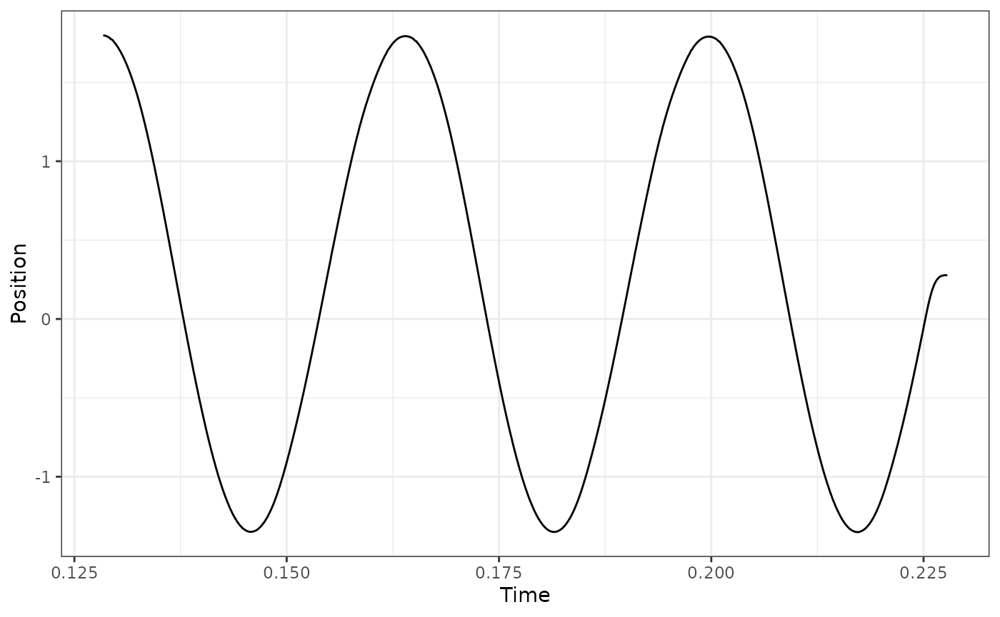
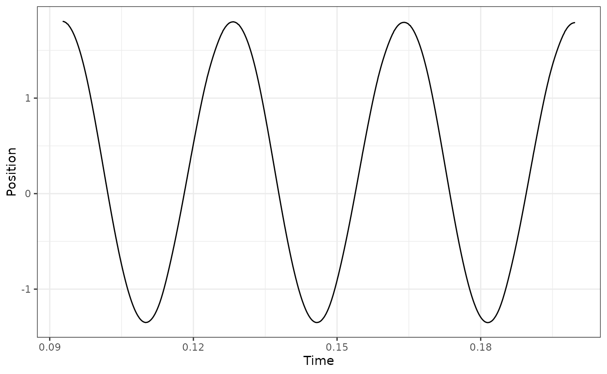
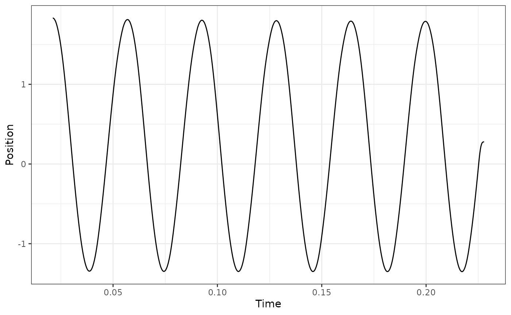

# Analyzing work loop experiments in workloopR

The function
[`analyze_workloop()`](https://docs.ropensci.org/workloopR/reference/analyze_workloop.md)
in `workloopR` allows users to evaluate the mechanical work and power
output of a muscle they have investigated through work loop experiments.

To demonstrate
[`analyze_workloop()`](https://docs.ropensci.org/workloopR/reference/analyze_workloop.md),
we will first load `workloopR` and use example data provided with the
package. We’ll also load a couple packages within the `tidyverse` to
help with data wrangling and plotting.

## Load packages and data

``` r

library(workloopR)
library(magrittr)
library(ggplot2)
library(dplyr)
```

## Visualize

We’ll now import the `workloop.ddf` file included with `workloopR`.
Because this experiment involved using a gear ratio of 2, we’ll use
[`fix_GR()`](https://docs.ropensci.org/workloopR/reference/fix_GR.md) to
also implement this correction.

Ultimately, an object of classes `workloop`, `muscle_stim`, and
`data.frame` is produced. `muscle_stim` objects are used throughout
`workloopR` to help with data formatting and error checking across
functions. Additionally setting the class to `workloop` allows our
functions to understand that the data have properties that other
experiment types (twitch, tetanus) do not.

``` r

## The file workloop.ddf is included and therefore can be accessed via
## system.file("subdirectory","file_name","package") . We'll then use
## read_ddf() to import it, creating an object of class "muscle_stim".
## fix_GR() multiplies Force by 2 and divides Position by 2
workloop_dat <-
  system.file(
    "extdata",
    "workloop.ddf",
    package = 'workloopR') %>%
  read_ddf(phase_from_peak = TRUE) %>%
  fix_GR(GR = 2)

summary(workloop_dat)
#> # Workloop Data: 3 channels recorded over 0.3244s
#> 
#> File ID: workloop.ddf
#> Mod Time (mtime): 2026-08-30 07:15:22
#> Sample Frequency: 10000Hz
#> 
#> data.frame Columns: 
#>   Position (mm)
#>   Force (mN)
#>   Stim (TTL)
#> 
#> Stimulus Offset: 0.012s
#> Stimulus Frequency: 300Hz
#> Stimulus Width: 0.2ms
#> Stimulus Pulses: 4
#> Gear Ratio: 2
#> 
#> Cycle Frequency: 28Hz
#> Total Cycles (L0-to-L0): 6
#> Amplitude: 1.575mm
```

Running [`summary()`](https://rdrr.io/r/base/summary.html) on a
\`muscle_stim shows a handy summary of file properties, data, and
experimental parameters.

Let’s plot Time against Force, Position, and Stimulus (Stim) to
visualize the time course of the work loop experiment.

To get them all plotted in the same figure, we’ll transform the data as
they are being plotted. Please note that this is for aesthetic purposes
only - the underlying data will not be changed after the plotting is
complete.

``` r

scale_position_to_force <- 3000

workloop_dat %>%
  # Set the x axis for the whole plot
  ggplot(aes(x = Time)) +
  # Add a line for force
  geom_line(aes(y = Force, color = "Force"), 
            lwd = 1) +
  # Add a line for Position, scaled to approximately the same range as Force
  geom_line(aes(y = Position * scale_position_to_force, color = "Position")) +
  # For stim, we only want to plot where stimulation happens, so we filter the data
  geom_point(aes(y = 0, color = "Stim"), size = 1, 
             data = filter(workloop_dat, Stim == 1)) +
  # Next we add the second y-axis with the corrected units
  scale_y_continuous(sec.axis = sec_axis(~ . / scale_position_to_force, name = "Position (mm)")) +
  # Finally set colours, labels, and themes
  scale_color_manual(values = c("#FC4E2A", "#4292C6", "#373737")) +
  labs(y = "Force (mN)", x = "Time (secs)", color = "Parameter:") +
  ggtitle("Time course of \n work loop experiment") +
  theme_bw() +
  theme(legend.position = "bottom", legend.direction = "horizontal")
```



There’s a lot to digest here. The blue trace shows the change in length
of the muscle via cyclical, sinusoidal changes to Position. The dark
gray Stim dots show stimulation on a off vs. on basis. Stimulus onset is
close to when the muscle is at L0 and the stimulator zapped the muscle
four times in pulses of 0.2 ms width at 300 Hz. The resulting force
development is shown in red. These cycles of length change and
stimulation occurred a total of 6 times (measuring L0-to-L0).

## Select cycles

We are now ready to run the
[`select_cycles()`](https://docs.ropensci.org/workloopR/reference/select_cycles.md)
function. This function subsets the data and labels each cycle in prep
for our
[`analyze_workloop()`](https://docs.ropensci.org/workloopR/reference/analyze_workloop.md)
function.

In many cases, researchers are interested in using the final 3 cycles
for analyses. Accordingly, we’ll set the `keep_cycles` parameter to
`4:6`.

One thing to pay heed to is the cycle definition, encoded as `cycle_def`
within the arguments of
[`select_cycles()`](https://docs.ropensci.org/workloopR/reference/select_cycles.md).
There are three options for how cycles can be defined and are named
based on the starting (and ending) points of the cycle. We’ll use the
L0-to-L0 option, which is encoded as `lo`.

The function internally performs butterworth filtering of the Position
data via
[`signal::butter()`](https://rdrr.io/pkg/signal/man/butter.html). This
is because Position data are often noisy, which makes assessing true
peak values difficult. The default values of `bworth_order = 2` and
`bworth_freq = 0.05` work well in most cases, but we recommend you
please plot your data and assess this yourself.

We will keep things straightforward for now so that we can proceed to
the analytical stage. Please see the final section of this vignette for
more details on using
[`select_cycles()`](https://docs.ropensci.org/workloopR/reference/select_cycles.md).

``` r

## Select cycles
workloop_selected <- 
  workloop_dat %>%
  select_cycles(cycle_def="lo", keep_cycles = 4:6)

summary(workloop_selected)
#> # Workloop Data: 4 channels recorded over 0.1086s
#> 
#> File ID: workloop.ddf
#> Mod Time (mtime): 2026-08-30 07:15:22
#> Sample Frequency: 10000Hz
#> 
#> data.frame Columns: 
#>   Position (mm)
#>   Force (mN)
#>   Stim (TTL)
#>   Cycle (letters)
#> 
#> Stimulus Offset: 0.012s
#> Stimulus Frequency: 300Hz
#> Stimulus Width: 0.2ms
#> Stimulus Pulses: 4
#> Gear Ratio: 2
#> 
#> Cycle Frequency: 28Hz
#> Total Cycles (L0-to-L0): 6
#> Cycles Retained: 3
#> Amplitude: 1.575mm

attr(workloop_selected, "retained_cycles")
#> [1] 4 5 6
```

The [`summary()`](https://rdrr.io/r/base/summary.html) function now
reflects that 3 cycles of the original 6 have been retained, and getting
the `"retained_cycles"` attribute shows that these cycles are 4, 5, and
6 from the original data.

To avoid confusion in numbering schemes between the original data and
the new object, once
[`select_cycles()`](https://docs.ropensci.org/workloopR/reference/select_cycles.md)
has been used we label cycles by letter. So, cycle 4 is now “a”, 5 is
“b” and 6 is “c”.

## Plot the work loop cycles

``` r

workloop_selected %>%
  ggplot(aes(x = Position, y = Force)) +
  geom_point(size=0.3) +
  labs(y = "Force (mN)", x = "Position (mm)") +
  ggtitle("Work loop") +
  theme_bw()
```



## Basics of `analyze_workloop()`

Now we’re ready to use
[`analyze_workloop()`](https://docs.ropensci.org/workloopR/reference/analyze_workloop.md).

Again, running
[`select_cycles()`](https://docs.ropensci.org/workloopR/reference/select_cycles.md)
beforehand was necessary, so we will switch to using `workloop_selected`
as our data object.

Within
[`analyze_workloop()`](https://docs.ropensci.org/workloopR/reference/analyze_workloop.md),
the `GR =` option allows for the gear ratio to be corrected if it hasn’t
been already. But because we already ran
[`fix_GR()`](https://docs.ropensci.org/workloopR/reference/fix_GR.md) to
correct the gear ratio to 2, we will not need to use it here again. So,
this for this argument, we will use `GR = 1`, which keeps the data as
they are. Please take care to ensure that you do not overcorrect for
gear ratio by setting it multiple times. Doing so induces multiplicative
changes. E.g. setting `GR = 3` on an object and then setting `GR = 3`
again produces a gear ratio correction of 9.

### Using the default `simplify = FALSE` version

The argument `simplify =` affects the output of the
[`analyze_workloop()`](https://docs.ropensci.org/workloopR/reference/analyze_workloop.md)
function. We’ll first take a look at the organization of the “full”
version, i.e. keeping the default `simplify = FALSE`.

``` r

## Run the analyze_workloop() function
workloop_analyzed <-
  workloop_selected %>%
  analyze_workloop(GR = 1)

## Produces a list of objects. 
## The print method gives a simple output:
workloop_analyzed
#> File ID: workloop.ddf
#> Cycles: 3 cycles kept out of 6
#> Mean Work: 0.0033 J
#> Mean Power: 0.09589 W

## How is the list organized?
names(workloop_analyzed)
#> [1] "cycle_a" "cycle_b" "cycle_c"
```

This produces an `analyzed_workloop` object that is essentially a `list`
that is organized by cycle. Within each of these, time-course data are
stored as a `data.frame` and important metadata are stored as
attributes.

Users may typically want work and net power from each cycle. Within the
`analyzed_workloop` object, these two values are stored as attributes:
`"work"` (in J) and `"net_power"` (in W). To get them for a specific
cycle:

``` r

## What is work for the second cycle?
attr(workloop_analyzed$cycle_b, "work")
#> [1] 0.003282334

## What is net power for the third cycle?
attr(workloop_analyzed$cycle_c, "net_power")
#> [1] 0.09812219
```

To see how e.g. the first cycle is organized:

``` r

str(workloop_analyzed$cycle_a)
#> Classes 'workloop', 'muscle_stim' and 'data.frame':  357 obs. of  9 variables:
#>  $ Time            : num  0.119 0.119 0.119 0.12 0.12 ...
#>  $ Position        : num  0.33 0.359 0.389 0.414 0.441 ...
#>  $ Force           : num  1708 1718 1725 1734 1744 ...
#>  $ Stim            : int  1 1 0 0 0 0 0 0 0 0 ...
#>  $ Cycle           : chr  "a" "a" "a" "a" ...
#>  $ Inst_Velocity   : num  NA -0.292 -0.292 -0.252 -0.271 ...
#>  $ Filt_Velocity   : num  NA -0.143 -0.158 -0.172 -0.185 ...
#>  $ Inst_Power      : num  NA -0.246 -0.272 -0.298 -0.322 ...
#>  $ Percent_of_Cycle: num  0 0.281 0.562 0.843 1.124 ...
#>  - attr(*, "stimulus_frequency")= int 300
#>  - attr(*, "cycle_frequency")= int 28
#>  - attr(*, "total_cycles")= num 6
#>  - attr(*, "cycle_def")= chr "lo"
#>  - attr(*, "amplitude")= num 1.57
#>  - attr(*, "phase")= num -24.9
#>  - attr(*, "position_inverted")= logi FALSE
#>  - attr(*, "units")= chr [1:8] "s" "mm" "mN" "TTL" ...
#>  - attr(*, "sample_frequency")= num 10000
#>  - attr(*, "header")= chr [1:4] "Sample Frequency (Hz): 10000" "Reference Area: NaN sq. mm" "Reference Force: NaN mN" "Reference Length: NaN mm"
#>  - attr(*, "units_table")='data.frame':  10 obs. of  5 variables:
#>   ..$ Channel: chr [1:10] "AI0" "AI1" "AI2" "AI3" ...
#>   ..$ Units  : chr [1:10] "mm" "mN" "TTL" "" ...
#>   ..$ Scale  : num [1:10] 1 500 0.2 0 0 0 0 0 1 500
#>   ..$ Offset : num [1:10] 0 0 0 0 0 0 0 0 0 0
#>   ..$ TADs   : num [1:10] 0 0 0 0 0 0 0 0 0 0
#>  - attr(*, "protocol_table")='data.frame':   4 obs. of  5 variables:
#>   ..$ Wait.s     : num [1:4] 0 0.01 0 0.1
#>   ..$ Then.action: chr [1:4] "Stimulus-Train" "Sine Wave" "Stimulus-Train" "Stop"
#>   ..$ On.port    : chr [1:4] "Stimulator" "Length Out" "Stimulator" ""
#>   ..$ Units      : chr [1:4] ".012, 300, 0.2, 4, 28" "28,3.15,6" "0,0,0,0,0" ""
#>   ..$ Parameters : logi [1:4] NA NA NA NA
#>  - attr(*, "stim_table")='data.frame':   2 obs. of  5 variables:
#>   ..$ offset         : num [1:2] 0.012 0
#>   ..$ frequency      : int [1:2] 300 0
#>   ..$ width          : num [1:2] 0.2 0
#>   ..$ pulses         : int [1:2] 4 0
#>   ..$ cycle_frequency: int [1:2] 28 0
#>  - attr(*, "stimulus_pulses")= int 4
#>  - attr(*, "stimulus_offset")= num 0.012
#>  - attr(*, "stimulus_width")= num 0.2
#>  - attr(*, "gear_ratio")= num 2
#>  - attr(*, "file_id")= chr "workloop.ddf"
#>  - attr(*, "mtime")= POSIXct[1:1], format: "2026-08-30 07:15:22"
#>  - attr(*, "retained_cycles")= int [1:3] 4 5 6
#>  - attr(*, "work")= num 0.00301
#>  - attr(*, "net_power")= num 0.0909
```

Within each cycle’s `data.frame`, the usual `Time`, `Position`, `Force`,
and `Stim` are stored. `Cycle`, added via
[`select_cycles()`](https://docs.ropensci.org/workloopR/reference/select_cycles.md),
denotes cycle identity and `Percent_of_Cycle` displays time as a
percentage of that particular cycle.

[`analyze_workloop()`](https://docs.ropensci.org/workloopR/reference/analyze_workloop.md)
also computes instantaneous velocity (`Inst_Velocity`) which can
sometimes be noisy, leading us to also apply a butterworth filter to
this velocity (`Filt_Velocity`). See the function’s help file for more
details on how to tweak filtering. The time course of power
(instantaneous power) is also provided as `Inst_Power`.

Each of these variables can be plot against Time to see the time-course
of that variable’s change over the cycle. For example, we will plot
instantaneous force in cycle b:

``` r

workloop_analyzed$cycle_b %>%
  ggplot(aes(x = Percent_of_Cycle, y = Inst_Power)) +
  geom_line(lwd = 1) +
  labs(y = "Instantaneous Power (W)", x = "Percent cycle") +
  ggtitle("Instantaneous power \n during cycle b") +
  theme_bw()
#> Warning: Removed 1 row containing missing values or values outside the scale range
#> (`geom_line()`).
```



### Setting `simpilfy = TRUE` in the `analyze_workloop()` function

If you simply want work and net power for each cycle without retaining
any of the time-course data, set `simplify = TRUE` within
[`analyze_workloop()`](https://docs.ropensci.org/workloopR/reference/analyze_workloop.md).

``` r

workloop_analyzed_simple <-
  workloop_selected %>%
  analyze_workloop(GR = 1, simplify = TRUE)

## Produces a simple data.frame:
workloop_analyzed_simple
#>   Cycle        Work  Net_Power
#> a     A 0.003007098 0.09085517
#> b     B 0.003282334 0.09870268
#> c     C 0.003601049 0.09812219
str(workloop_analyzed_simple)
#> 'data.frame':    3 obs. of  3 variables:
#>  $ Cycle    : chr  "A" "B" "C"
#>  $ Work     : num  0.00301 0.00328 0.0036
#>  $ Net_Power: num  0.0909 0.0987 0.0981
```

Here, work (in J) and net power (in W) are simply returned in a
`data.frame` that is organized by cycle. No other attributes are stored.

## More on cycle definitions in `select_cycles()`

As noted above, there are three options for cycle definitions within
[`select_cycles()`](https://docs.ropensci.org/workloopR/reference/select_cycles.md),
encoded as `cycle_def`. The three options for how cycles can be defined
are named based on the starting (and ending) points of the cycle:
L0-to-L0 (`lo`), peak-to-peak (`p2p`), and trough-to-trough (`t2t`).

We highly recommend that you plot your Position data after using
[`select_cycles()`](https://docs.ropensci.org/workloopR/reference/select_cycles.md).
The
[`pracma::findpeaks()`](https://rdrr.io/pkg/pracma/man/findpeaks.html)
function work for most data (especially sine waves), but it is
conceivable that small, local ‘peaks’ may be misinterpreted as a cycle’s
true minimum or maximum.

We also note that edge cases (i.e. the first cycle or the final cycle)
may also be subject to issues in which the cycles are not super well
defined via an automated algorithm.

Below, we will plot a couple case examples to show what we generally
expect. We recommend plotting your data in a similar fashion to verify
that
[`select_cycles()`](https://docs.ropensci.org/workloopR/reference/select_cycles.md)
is behaving in the way you expect.

``` r

## Select cycles 4:6 using lo
workloop_dat %>%
  select_cycles(cycle_def="lo", keep_cycles = 4:6) %>%
  ggplot(aes(x = Time, y = Position)) +
  geom_line() +
  theme_bw()
```



``` r


## Select cycles 4:6 using p2p
workloop_dat %>%
  select_cycles(cycle_def="p2p", keep_cycles = 4:6) %>%
  ggplot(aes(x = Time, y = Position)) +
  geom_line() +
  theme_bw()
```



``` r

## here we see that via 'p2p' the final cycle is ill-defined because the return
## to L0 is considered a cycle. Using a p2p definition, what we actually want is
## to use cycles 3:5 to get the final 3 full cycles:
workloop_dat %>%
  select_cycles(cycle_def="p2p", keep_cycles = 3:5) %>%
  ggplot(aes(x = Time, y = Position)) +
  geom_line() +
  theme_bw()
```



``` r


## this difficulty in defining cycles may be more apparent by first plotting the 
## cycles 1:6, e.g.
workloop_dat %>%
  select_cycles(cycle_def="p2p", keep_cycles = 1:6) %>%
  ggplot(aes(x = Time, y = Position)) +
  geom_line() +
  theme_bw()
```


