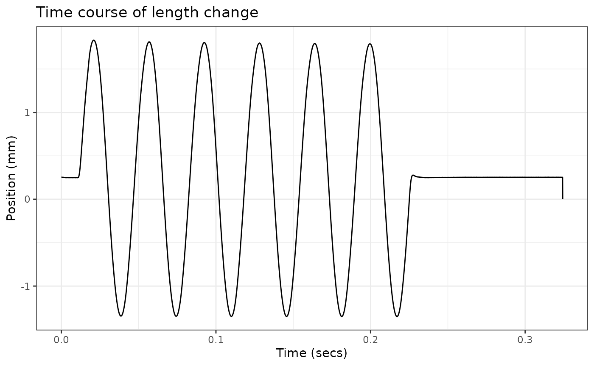

# Importing data from non .ddf sources

`workloopR`’s data import functions, such as
[`read_ddf()`](https://docs.ropensci.org/workloopR/reference/read_ddf.md),
are generally geared towards importing data from .ddf files (e.g. those
generated by Aurora Scientific’s Dynamic Muscle Control and Analysis
Software).

Should your data be stored in another file format, you can use the
[`as_muscle_stim()`](https://docs.ropensci.org/workloopR/reference/as_muscle_stim.md)
function to generate your own `muscle_stim` objects. These `muscle_stim`
objects are used by nearly all other `workloopR` functions and are
formatted in a very specific way. This helps ensure that other functions
can interpret data & metadata correctly and also perform internal
checks.

## Load packages

Before running through anything, we’ll ensure we have the packages we
need.

``` r

library(workloopR)
library(magrittr)
library(ggplot2)
```

## Data

Because it is somewhat difficult to simulate muscle physiology data,
we’ll use one of our workloop files, deconstruct it, and then
re-assemble the data via
[`as_muscle_stim()`](https://docs.ropensci.org/workloopR/reference/as_muscle_stim.md).

``` r

## Load in the work loop example data from workloopR
workloop_dat <-
  system.file(
    "extdata",
    "workloop.ddf",
    package = 'workloopR') %>%
  read_ddf(phase_from_peak = TRUE) %>%
  fix_GR(GR = 2)

## First we'll extract Time
Time <- workloop_dat$Time
## Now Position
Position <- workloop_dat$Position
## Force
Force <- workloop_dat$Force
## Stimulation
Stim <- workloop_dat$Stim

## Put it all together as a data.frame
my_data <- data.frame(Time = Time,
                      Position = Position,
                      Force = Force,
                      Stim = Stim)

head(my_data)
#>    Time  Position   Force Stim
#> 1 1e-04 0.2519695 609.743    0
#> 2 2e-04 0.2530985 611.033    0
#> 3 3e-04 0.2527760 609.743    0
#> 4 4e-04 0.2530985 608.775    0
#> 5 5e-04 0.2526145 610.388    0
#> 6 6e-04 0.2534210 610.066    0
```

## Assemble via `as_muscle_stim()`

It is absolutely crucial that the columns be named “Time”, “Position”,
“Force”, and “Stim” (all case-sensitive). Otherwise,
[`as_muscle_stim()`](https://docs.ropensci.org/workloopR/reference/as_muscle_stim.md)
will not interpret data correctly.

At minimum, this `data.frame`, the type of experiment, and the frequency
at which data were recorded (`sample_frequency`, as a numeric) are
necessary for
[`as_muscle_stim()`](https://docs.ropensci.org/workloopR/reference/as_muscle_stim.md).

``` r

## Put it together
my_muscle_stim <- as_muscle_stim(x = my_data,
                                 type = "workloop",
                                 sample_frequency = 10000)

## Data are stored in columns and basically behave as data.frames
head(my_muscle_stim)
#> # Workloop Data: 3 channels recorded over 6e-04s
#> File ID: NA
#> 
#>    Time  Position   Force Stim
#> 1 0e+00 0.2519695 609.743    0
#> 2 1e-04 0.2530985 611.033    0
#> 3 2e-04 0.2527760 609.743    0
#> 4 3e-04 0.2530985 608.775    0
#> 5 4e-04 0.2526145 610.388    0
#> 6 5e-04 0.2534210 610.066    0

ggplot(my_muscle_stim, aes(x = Time, y = Position)) +
  geom_line() + 
  labs(y = "Position (mm)", x = "Time (secs)") +
  ggtitle("Time course of length change") +
  theme_bw()
```



### Attributes

By default, a couple attributes are auto-filled based on the available
information, but it’s pretty bare-bones

``` r

str(attributes(my_muscle_stim))
#> List of 22
#>  $ names             : chr [1:4] "Time" "Position" "Force" "Stim"
#>  $ row.names         : int [1:3244] 1 2 3 4 5 6 7 8 9 10 ...
#>  $ class             : chr [1:3] "workloop" "muscle_stim" "data.frame"
#>  $ units             : logi NA
#>  $ header            : logi NA
#>  $ units_table       : logi NA
#>  $ protocol_table    : logi NA
#>  $ stim_table        : logi NA
#>  $ stimulus_pulses   : logi NA
#>  $ stimulus_offset   : logi NA
#>  $ stimulus_width    : logi NA
#>  $ gear_ratio        : num 1
#>  $ file_id           : logi NA
#>  $ mtime             : logi NA
#>  $ stimulus_frequency: logi NA
#>  $ cycle_frequency   : logi NA
#>  $ total_cycles      : logi NA
#>  $ cycle_def         : logi NA
#>  $ amplitude         : logi NA
#>  $ phase             : logi NA
#>  $ position_inverted : logi FALSE
#>  $ sample_frequency  : num 10000
```

We highly encourage you to add in as many of these details as possible
by passing them in via the `...` argument. For example:

``` r

## This time, add the file's name via "file_id"
my_muscle_stim <- as_muscle_stim(x = my_data,
                                 type = "workloop",
                                 sample_frequency = 10000,
                                 file_id = "workloop123")

## For simplicity, we'll just target the file_id attribute directly instead of 
## printing all attributes again
attr(my_muscle_stim, "file_id")
#> [1] "workloop123"
```

### Possible attributes

Here is a list of all possible attributes that can be filled.

``` r

names(attributes(workloop_dat))
#>  [1] "names"              "row.names"          "stimulus_frequency"
#>  [4] "cycle_frequency"    "total_cycles"       "cycle_def"         
#>  [7] "amplitude"          "phase"              "position_inverted" 
#> [10] "units"              "sample_frequency"   "header"            
#> [13] "units_table"        "protocol_table"     "stim_table"        
#> [16] "stimulus_pulses"    "stimulus_offset"    "stimulus_width"    
#> [19] "gear_ratio"         "file_id"            "mtime"             
#> [22] "class"
```

To see how each should be formatted, (e.g. which ones take numeric
values vs. character vectors…etc)

``` r

str(attributes(workloop_dat))
#> List of 22
#>  $ names             : chr [1:4] "Time" "Position" "Force" "Stim"
#>  $ row.names         : int [1:3244] 1 2 3 4 5 6 7 8 9 10 ...
#>  $ stimulus_frequency: int 300
#>  $ cycle_frequency   : int 28
#>  $ total_cycles      : int 6
#>  $ cycle_def         : chr "lo"
#>  $ amplitude         : num 1.57
#>  $ phase             : num -24.9
#>  $ position_inverted : logi FALSE
#>  $ units             : chr [1:4] "s" "mm" "mN" "TTL"
#>  $ sample_frequency  : num 10000
#>  $ header            : chr [1:4] "Sample Frequency (Hz): 10000" "Reference Area: NaN sq. mm" "Reference Force: NaN mN" "Reference Length: NaN mm"
#>  $ units_table       :'data.frame':  10 obs. of  5 variables:
#>   ..$ Channel: chr [1:10] "AI0" "AI1" "AI2" "AI3" ...
#>   ..$ Units  : chr [1:10] "mm" "mN" "TTL" "" ...
#>   ..$ Scale  : num [1:10] 1 500 0.2 0 0 0 0 0 1 500
#>   ..$ Offset : num [1:10] 0 0 0 0 0 0 0 0 0 0
#>   ..$ TADs   : num [1:10] 0 0 0 0 0 0 0 0 0 0
#>  $ protocol_table    :'data.frame':  4 obs. of  5 variables:
#>   ..$ Wait.s     : num [1:4] 0 0.01 0 0.1
#>   ..$ Then.action: chr [1:4] "Stimulus-Train" "Sine Wave" "Stimulus-Train" "Stop"
#>   ..$ On.port    : chr [1:4] "Stimulator" "Length Out" "Stimulator" ""
#>   ..$ Units      : chr [1:4] ".012, 300, 0.2, 4, 28" "28,3.15,6" "0,0,0,0,0" ""
#>   ..$ Parameters : logi [1:4] NA NA NA NA
#>  $ stim_table        :'data.frame':  2 obs. of  5 variables:
#>   ..$ offset         : num [1:2] 0.012 0
#>   ..$ frequency      : int [1:2] 300 0
#>   ..$ width          : num [1:2] 0.2 0
#>   ..$ pulses         : int [1:2] 4 0
#>   ..$ cycle_frequency: int [1:2] 28 0
#>  $ stimulus_pulses   : int 4
#>  $ stimulus_offset   : num 0.012
#>  $ stimulus_width    : num 0.2
#>  $ gear_ratio        : num 2
#>  $ file_id           : chr "workloop.ddf"
#>  $ mtime             : POSIXct[1:1], format: "2026-08-30 07:15:22"
#>  $ class             : chr [1:3] "workloop" "muscle_stim" "data.frame"
```

## Thanks for reading!

Please feel free to contact either Vikram or Shree with suggestions or
code development requests. We are especially interested in expanding our
data import functions to accommodate file types other than .ddf in
future versions of `workloopR`.
